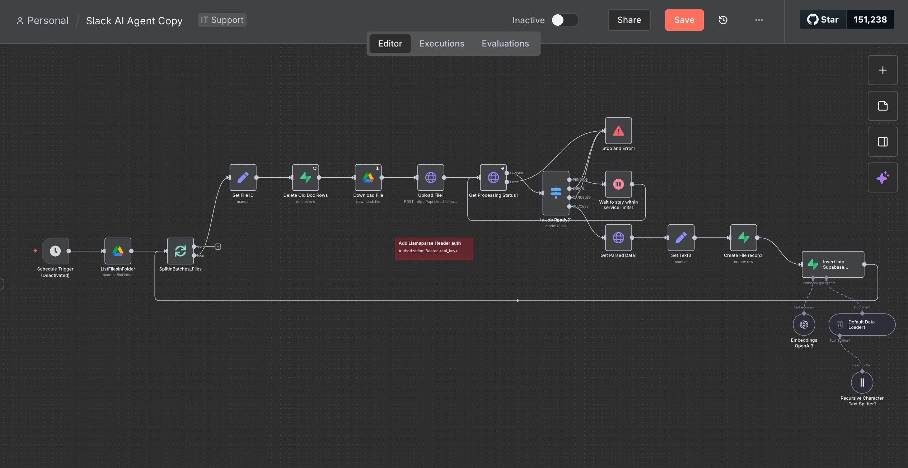
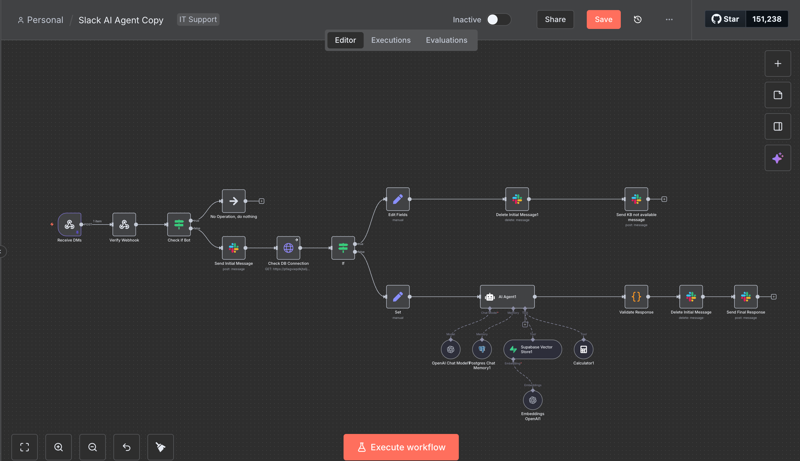

# Slack IT Knowledge Base RAG Agent

An intelligent n8n workflow that provides instant IT support through Slack using RAG (Retrieval-Augmented Generation). This workflow automatically answers IT questions by searching your knowledge base stored in Google Drive.

## Overview

This project demonstrates a production-ready implementation of a conversational AI agent for IT support teams. The bot monitors a Google Drive folder for IT documentation, processes and indexes the content using vector embeddings, and responds to Slack messages with accurate, source-cited answers.

### Key Features

- **Automated Knowledge Indexing**: Monitors Google Drive for new/updated documents
- **Intelligent Search**: Uses vector embeddings for semantic search (not just keyword matching)
- **Conversational Memory**: Maintains context across multiple messages
- **Source Attribution**: Always cites which document the information came from
- **Real-time Updates**: Automatically re-indexes when documents change

## Architecture

```
Google Drive (IT Documentation)
    ↓
n8n Workflow Triggers on File Changes
    ↓
LlamaParse Processes Documents
    ↓
Text Splitting + Vector Embeddings
    ↓
Supabase Vector Database
    ↓
User Asks Question in Slack
    ↓
RAG Agent Searches Knowledge Base
    ↓
Response with Source Citation
```
## Workflow Visualization

### Document Ingestion Pipeline
This workflow monitors Google Drive for new/updated documents, 
processes them through LlamaParse, and indexes them in the vector database.



### Slack Query Response Pipeline
This workflow handles incoming Slack messages, searches the knowledge base, 
and generates AI-powered responses with source citations.



### Technology Stack

- **n8n**: Workflow automation and orchestration
- **OpenAI GPT-4**: Language model for responses
- **OpenAI Embeddings**: Vector embeddings (ada-002)
- **Supabase**: PostgreSQL with pgvector extension
- **LlamaParse**: Document processing (PDF, DOCX, etc.)
- **Slack**: User interface
- **Google Drive**: Document storage

## Use Cases

Perfect for IT teams that want to:
- Reduce repetitive support tickets
- Provide 24/7 access to IT knowledge
- Onboard new team members faster
- Scale IT support without adding headcount
- Centralize IT documentation

## Prerequisites

You'll need accounts/access for:
- n8n instance (cloud or self-hosted v1.0+)
- Slack workspace with admin permissions
- Google Cloud Platform (for Drive API)
- Supabase account (free tier works)
- OpenAI API key
- LlamaIndex account (for LlamaParse)

## Quick Start

**Setup time: ~30 minutes**

1. **Clone this repository**
2. **Set up Supabase database** (run SQL script in docs/SETUP.md)
3. **Import workflow** to n8n from `workflows/slack-it-rag-agent.json`
4. **Configure credentials** in n8n for all services
5. **Connect Slack webhook** for receiving messages
6. **Upload IT documentation** to your Google Drive folder
7. **Activate workflow** and test

Detailed setup instructions: [docs/SETUP.md](docs/SETUP.md)

## Project Structure

```
slack-it-rag-agent/
├── workflows/
│   └── slack-it-rag-agent.json       # Main n8n workflow (sanitized)
├── docs/
│   ├── SETUP.md                       # Complete setup guide
│   └── TROUBLESHOOTING.md             # Common issues & solutions
├── .env.example                       # Environment variables template
├── .gitignore                         # Security exclusions
├── LICENSE                            # MIT License
└── README.md                          # This file
```

## Configuration

All sensitive credentials are managed through n8n's credential system. See `.env.example` for required environment variables.

### Required Credentials

| Service | Type | Used For |
|---------|------|----------|
| Slack | OAuth Token | Sending/receiving messages |
| Google Drive | Service Account | Monitoring document folder |
| Supabase | API Key | Vector database storage |
| OpenAI | API Key | Embeddings + chat completion |
| PostgreSQL | Connection String | Conversation memory |
| LlamaParse | Bearer Token | Document processing |

## How It Works

### Document Ingestion Pipeline

1. Google Drive trigger monitors folder for changes
2. New/updated files are sent to LlamaParse for processing
3. Extracted text is split into chunks (1000 chars, 200 overlap)
4. Each chunk is converted to vector embeddings
5. Embeddings are stored in Supabase with metadata

### Query Response Pipeline

1. User sends message to Slack bot
2. Message triggers n8n webhook
3. Bot filters out its own messages
4. User query is converted to vector embedding
5. Semantic search finds relevant document chunks
6. AI agent generates response using retrieved context
7. Response is validated and sent back to Slack
8. Conversation is saved to PostgreSQL for memory

## Performance

- **Average response time**: 3-5 seconds
- **Knowledge base capacity**: 500+ documents tested
- **Retrieval accuracy**: ~85% (Top-3 chunks)
- **Estimated cost**: $10-50/month (moderate usage)

## Customization

### Adjust System Prompt

Edit the AI Agent node to customize behavior:
```
You are an IT support assistant for [YOUR_COMPANY].
Answer questions using only the knowledge base provided.
Always cite your sources as "Source: [filename]".
If information isn't available, say so and direct users to IT helpdesk.
```

### Tune Search Parameters

- **Top K**: Number of document chunks to retrieve (default: 3)
- **Chunk Size**: Text split size (default: 1000 characters)
- **Similarity Threshold**: Minimum relevance score (default: 0.7)

## Troubleshooting

Common issues and solutions are documented in [docs/TROUBLESHOOTING.md](docs/TROUBLESHOOTING.md).

**Quick fixes:**
- Bot not responding? Check workflow is Active and webhook is verified
- Poor answers? Increase Top K or adjust similarity threshold
- Documents not indexing? Verify Google Drive service account permissions

## Security Notes

- All credentials are sanitized in the public workflow
- Never commit `.env` files to version control
- Use environment variables for all sensitive data
- Review `.gitignore` to ensure proper exclusions
- Rotate API keys regularly (every 90 days recommended)

## Contributing

This is a learning project and community contributions are welcome! Feel free to:
- Open issues for bugs or questions
- Submit pull requests for improvements
- Share your customizations and use cases

## License

MIT License - see [LICENSE](LICENSE) file for details.

## Acknowledgments

- n8n community for workflow patterns
- LlamaIndex for excellent document parsing
- Supabase for vector database hosting
- OpenAI for embeddings and language models

## Resources

- **n8n Documentation**: [docs.n8n.io](https://docs.n8n.io)
- **Supabase Docs**: [supabase.com/docs](https://supabase.com/docs)
- **OpenAI API**: [platform.openai.com/docs](https://platform.openai.com/docs)
- **LlamaParse**: [docs.llamaindex.ai/en/stable/llama_cloud/llama_parse.html](https://docs.llamaindex.ai/en/stable/llama_cloud/llama_parse.html)

---

**Note**: This workflow demonstrates RAG (Retrieval-Augmented Generation) architecture for production IT support automation. It serves as a template for teams looking to implement AI-powered knowledge bases without extensive ML engineering resources.
